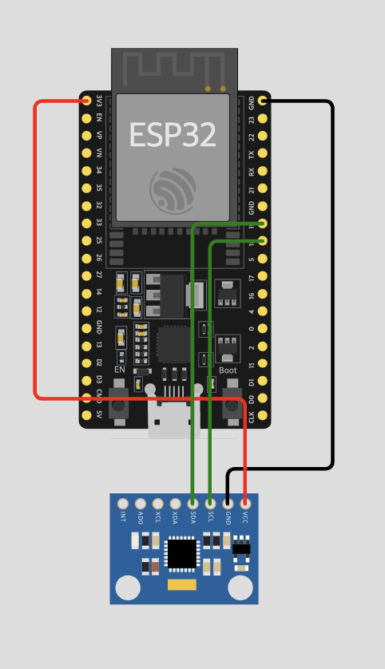
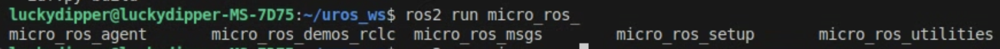
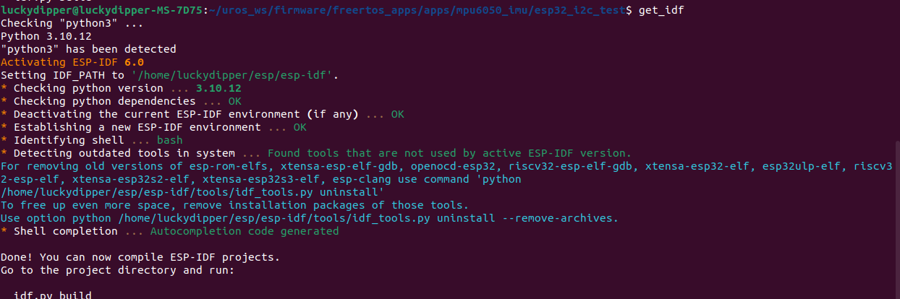
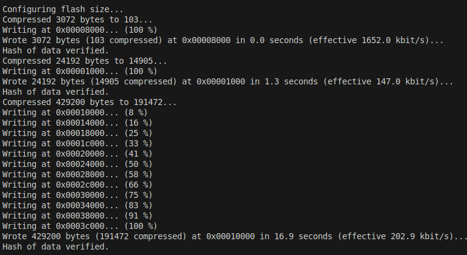
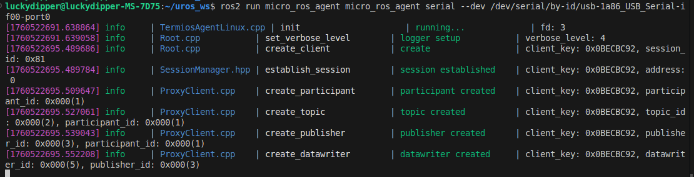
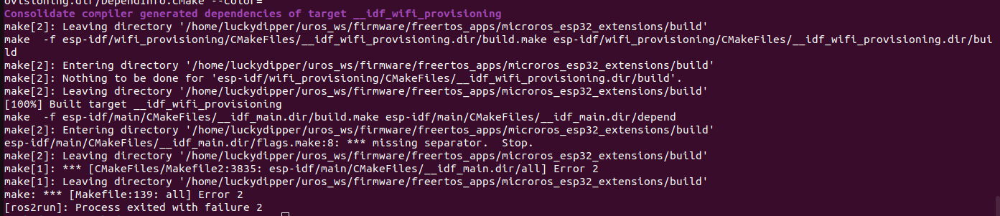

# micro-ROS ESP32 MPU6050 IMU Integration

**Language:** [English] | [한국어](./readme_ko.md)

---

## Table of Contents

1. [Overview](#1-overview)
2. [Hardware Requirements](#2-hardware-requirements)
3. [Wiring Diagram](#3-wiring-diagram)
4. [Software Installation](#4-software-installation)
   - 4.1. [Install micro-ROS](#41-install-micro-ros)
   - 4.2. [Install ESP32 IDF](#42-install-esp32-idf)
   - 4.3. [Download FreeRTOS Firmware](#43-download-freertos-firmware)
   - 4.4. [Add IMU Control Module](#44-add-imu-control-module)
5. [Build and Flash](#5-build-and-flash)
6. [Running the Application](#6-running-the-application)
   - 6.1. [Build the Agent](#61-build-the-agent)
   - 6.2. [Identify USB Port](#62-identify-usb-port)
   - 6.3. [Start Publishing IMU Data](#63-start-publishing-imu-data)
7. [Troubleshooting](#7-troubleshooting)
   - 7.1. [Flashing Errors](#71-flashing-errors)
   - 7.2. [IMU Data Reading Issues](#72-imu-data-reading-issues)
8. [References](#8-references)
9. [Wifi](#9-wifi-connection)

---

|Demo Video|Wire Connection|Wifi Connection|
|---|---|---|
|[](https://youtube.com/shorts/8mY6yMOH74g?feature=share)|||

---

## 1. Overview

This tutorial demonstrates how to obtain IMU messages in ROS2 using the micro-ROS framework. It connects an MPU6050 IMU sensor to an ESP32 via I2C serial communication and retrieves sensor data using an RTOS-based approach.

**Key Features:**
- Real-time IMU data streaming to ROS2
- I2C communication with MPU6050
- Serial transport layer for micro-ROS
- FreeRTOS-based implementation

---

## 2. Hardware Requirements

**BOM:** https://docs.google.com/spreadsheets/d/1wX9Iwj8zxzniESLLwfLKfVcVwFZRYK2gtmtsNySbq_Y/edit?usp=sharing

|Component|Description|
|---------|-----------|
|ESP32 Development Board|Any ESP32 board (ESP32-WROOM or similar)|
|MPU6050 IMU Sensor|6-axis accelerometer and gyroscope|
|USB Cable|USB-C or Micro USB (must support data transfer)|
|Jumper Wires|4 wires minimum |
|Breadboard|For prototyping connections|
5-pin connector, micro usb connector (for esp32 connection)

---

## 3. Wiring Diagram

Connect the MPU6050 to ESP32 as follows:

```
ESP32 Pin    →    MPU6050 Pin
─────────────────────────────
3.3V         →    VCC
GND          →    GND
GPIO 18      →    SDA
GPIO 19      →    SCL
```

|Simulation|Real World|
|----------|----------|
|||

- Use **3.3V only** for MPU6050 VCC (NOT 5V!)
- Ensure solid wire connections
- GPIO 18 (SDA) and GPIO 19 (SCL) are configured as I2C pins for this project

---

## 4. Software Installation

### 4.1. Install micro-ROS

Follow the official micro-ROS tutorial: https://micro.ros.org/docs/tutorials/core/first_application_linux/

```bash
source /opt/ros/$ROS_DISTRO/setup.bash

# Create workspace and download micro-ROS tools
cd ~/
mkdir microros_ws
cd microros_ws
git clone -b $ROS_DISTRO https://github.com/micro-ROS/micro_ros_setup.git src/micro_ros_setup

# Update dependencies
sudo apt update && rosdep update
rosdep install --from-paths src --ignore-src -y

# Install pip
sudo apt-get install python3-pip

# Build micro-ROS tools
colcon build
source install/local_setup.bash
```

**Verification:**

|If installation is successful, you should see tab autocomplete working|
|---|
||

---

### 4.2. Install ESP32 IDF

Follow the ESP-IDF setup guide: https://docs.espressif.com/projects/esp-idf/en/stable/esp32/get-started/linux-macos-setup.html

Deactivate any Python virtual environments (venv, conda) before installation.
Complete up to **Step 4 (get_idf)** from the official tutorial.

```bash
# For Ubuntu 22.04, install dependencies
sudo apt-get install git wget flex bison gperf python3 python3-pip python3-venv \
  cmake ninja-build ccache libffi-dev libssl-dev dfu-util libusb-1.0-0

# Create ESP directory and clone ESP-IDF
mkdir -p ~/esp
cd ~/esp
git clone -b v5.5.1 --recursive https://github.com/espressif/esp-idf.git

# Install ESP-IDF
cd ~/esp/esp-idf
./install.sh all

# Register get_idf alias in bash
echo "alias get_idf='. \$HOME/esp/esp-idf/export.sh'" >> ~/.bashrc
```

**Verification:**

After installation, use the `get_idf` command to activate the ESP-IDF environment.

|If installation is successful, you should see the ESP-IDF environment activated|
|---|
||

---

### 4.3. Download FreeRTOS Firmware

Create the firmware workspace for ESP32:

```bash
cd ~/microros_ws
ros2 run micro_ros_setup create_firmware_ws.sh freertos esp32
```

After execution, a `firmware` folder will be created in your workspace.

---

### 4.4. Add IMU Control Module

Clone this repository into the firmware apps directory:

```bash
cd ~/microros_ws/firmware/freertos_apps/apps/
git clone https://github.com/luckydipper/mpu6050_imu.git
```

---

## 5. Build and Flash

### Configure, Build, and Flash the Firmware

```bash
cd ~/microros_ws

# Configure for your application
ros2 run micro_ros_setup configure_firmware.sh mpu6050_imu --transport serial

# Build the firmware
ros2 run micro_ros_setup build_firmware.sh

# Flash to ESP32
ros2 run micro_ros_setup flash_firmware.sh
```

**Critical Flashing Tips:**

1. **Cable Quality Matters:**
   - Use a **data-capable USB cable** (not charging-only cables)
   - USB-C to USB-C cable with 5-pin converter works well
   - Older USB to micro-USB cables often fail for data transfer

2. **Hold BOOT Button:**
   - Press and hold the **BOOT button** on ESP32 during flashing
   - Keep holding until you see "Writing at 0x..." messages
   - If holding doesn't work, try pressing it repeatedly

3. **Common Issues:**
   - If flashing fails, see the [Troubleshooting](#7-troubleshooting) section
   - Check USB cable first (most common issue)
   - Verify USB port permissions

**Verification:**

|If flashing is successful, you should see completion messages|
|---|
||

---

## 6. Running the Application

### 6.1. Build the Agent

Build the micro-ROS agent for ESP32 communication:

```bash
cd ~/microros_ws
ros2 run micro_ros_setup create_agent_ws.sh
ros2 run micro_ros_setup build_agent.sh
source install/local_setup.bash
```

---

### 6.2. Identify USB Port

Find your ESP32's USB port:

```bash
ls /dev/serial/by-id/*

# Example output:
# /dev/serial/by-id/usb-1a86_USB_Serial-if00-port0
```

Alternatively:
```bash
ls /dev/ttyUSB*
# or
ls /dev/ttyACM*
# Example: /dev/ttyUSB0
```

---

### 6.3. Start Publishing IMU Data

Run the micro-ROS agent:

```bash
ros2 run micro_ros_agent micro_ros_agent serial --dev /dev/serial/by-id/usb-1a86_USB_Serial-if00-port0

# Or use direct port:
ros2 run micro_ros_agent micro_ros_agent serial --dev /dev/ttyUSB0
```

**To see IMU data:**

Press the **RESET button** on ESP32. You should see:
- Connection established messages
- IMU topic appearing: `/imu/data_raw`



**Check topics:**
```bash
# In a new terminal
ros2 topic list

# Echo IMU data
ros2 topic echo /imu/data_raw
```

---

## 7. Troubleshooting

### 7.0 Build error

by,  
https://github.com/micro-ROS/micro_ros_setup/issues/580  
you should remove `Make[1]~~~` from flags.make files

### 7.1. Flashing Errors

#### Issue 1: Cannot Find Device

Check USB connection:
```bash
lsusb
# Disconnect and reconnect USB cable
lsusb
# Compare outputs - a new device should appear
```

If the device appears in `lsusb`, your cable supports data transfer.

---

#### Issue 2: Device Found But Cannot Connect

For ESP32-WROOM models, disable brltty service:

The `brltty` service can interfere with CH340/CH341 USB-to-serial drivers.

```bash
# Check if brltty is installed
dpkg -l | grep brltty

# Remove brltty (if present)
sudo apt remove brltty
```

Reference: https://www.reddit.com/r/pop_os/comments/uf54bi/how_to_remove_or_disable_brltty/

---

#### Issue 3: Hardware Connection Problems

1. Verify soldering quality (if using custom boards)
2. Try reversing the USB-C cable (some cables are directional)
3. Try a different USB port on your computer

---

#### Issue 4: Flash Corruption

If you've flashed multiple times, clean the build and flash memory:

```bash
# Remove build artifacts
rm -rf ~/microros_ws/firmware/freertos_apps/microros_esp32_extensions/build
rm -rf ~/microros_ws/firmware/freertos_apps/microros_esp32_extensions/install

# Erase ESP32 flash memory
esptool.py erase_flash

# Rebuild and reflash
cd ~/microros_ws
ros2 run micro_ros_setup build_firmware.sh
ros2 run micro_ros_setup flash_firmware.sh
```

---

### 7.2. IMU Data Reading Issues

#### Method 1: Check Serial Monitor

View ESP32 debug output directly:

```bash
screen /dev/ttyUSB0 115200
# Exit: Ctrl+A + D
```

This displays:
- I2C initialization status
- Device scan results
- MPU6050 WHO_AM_I register value
- Sensor data readings

---

#### Method 2: Test Without micro-ROS

Use standalone ESP-IDF test to verify hardware:

```bash
get_idf
cd ~/microros_ws/firmware/freertos_apps/apps/mpu6050_imu/esp32_i2c_test
source ~/microros_ws/firmware/toolchain/esp-idf/export.sh
idf.py build flash monitor
# Exit: Ctrl+]
```

This pure I2C test helps identify:
- Wiring issues
- Bad solder joints
- Wrong GPIO pins
- MPU6050 hardware problems

Many hardware issues are discovered using this isolated test.

---

#### Common IMU Issues

| Problem | Solution |
|---------|----------|
| No I2C devices found | Check 3.3V power and verify wiring |
| Wrong WHO_AM_I value | Check I2C address (0x68 or 0x69) |
| Erratic sensor readings | Check for loose connections |
| All zeros | MPU6050 in sleep mode or not powered |

---

## 8. References

### Official Documentation
- **micro-ROS:** https://micro.ros.org/
- **micro-ROS FreeRTOS Tutorial:** https://micro.ros.org/docs/tutorials/core/first_application_rtos/freertos/
- **ESP-IDF Setup:** https://docs.espressif.com/projects/esp-idf/en/stable/esp32/get-started/

### Community Resources
- Medium Tutorial: https://link.medium.com/JFof42RUwib
- ESP32 ROS2 Connection: https://medium.com/@SameerT009/connect-esp32-to-ros2-foxy-5f06e0cc64df

### Troubleshooting References
- brltty Issue: https://brltty.app/
- micro-ROS Setup Issues: https://github.com/micro-ROS/micro_ros_setup/issues/580
- esptool Problems: https://github.com/espressif/esptool/issues/626

---

## 9. wifi connection
Ref. https://medium.com/@SameerT009/connect-esp32-to-ros2-foxy-5f06e0cc64df  
you can follow after step4. Configuring created firmware in that link. Your host machin must have WIFI NIC to share IP.
