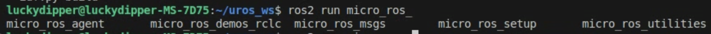

# micro-ROS ESP32 MPU6050 IMU 통합

**언어:** [English](./readme.md) | [한국어]

---

## 목차

1. [개요](#1-개요)
2. [하드웨어 요구사항](#2-하드웨어-요구사항)
3. [배선도](#3-배선도)
4. [소프트웨어 설치](#4-소프트웨어-설치)
   - 4.1. [micro-ROS 설치](#41-micro-ros-설치)
   - 4.2. [ESP32 IDF 설치](#42-esp32-idf-설치)
   - 4.3. [FreeRTOS 펌웨어 다운로드](#43-freertos-펌웨어-다운로드)
   - 4.4. [IMU 제어 모듈 추가](#44-imu-제어-모듈-추가)
5. [빌드 및 플래싱](#5-빌드-및-플래싱)
6. [애플리케이션 실행](#6-애플리케이션-실행)
   - 6.1. [에이전트 빌드](#61-에이전트-빌드)
   - 6.2. [USB 포트 확인](#62-usb-포트-확인)
   - 6.3. [IMU 데이터 퍼블리싱 시작](#63-imu-데이터-퍼블리싱-시작)
7. [문제 해결](#7-문제-해결)
   - 7.1. [플래싱 오류](#71-플래싱-오류)
   - 7.2. [IMU 데이터 읽기 문제](#72-imu-데이터-읽기-문제)
8. [참고 자료](#8-참고-자료)
9. [Wifi](#9-wifi-connection)

---

|Demo Video|Wire Connection|Wifi Connection|
|---|---|---|
|[](https://youtube.com/shorts/8mY6yMOH74g?feature=share)|||

---

## 1. 개요

이 튜토리얼은 micro-ROS 프레임워크를 사용하여 ROS2에서 IMU 메시지를 가져오는 것을 목표로 합니다. I2C 시러얼 통신으로 MPU6050 IMU 센서를 ESP32에 연결해, RTOS기반으로 센서를 가져오는 튜토리얼입니다.

---

## 2. 하드웨어 요구사항

BOM
https://docs.google.com/spreadsheets/d/1wX9Iwj8zxzniESLLwfLKfVcVwFZRYK2gtmtsNySbq_Y/edit?usp=sharing

esp32, mpu6050, 점프선, usb C2C 선, C to 5핀 컨버터, 브레드보드

---

## 3. 배선도

MPU6050을 ESP32에 다음과 같이 연결합니다:

```
ESP32 핀      →    MPU6050 핀
─────────────────────────────
3.3V         →    VCC
GND          →    GND
GPIO 18      →    SDA
GPIO 19      →    SCL
```

|시뮬레이션|실제|
|----------|----------|
|||

- MPU6050 VCC에는 **3.3V만** 사용하세요 (5V 사용 금지!)
- 배선 연결이 견고한지 확인하세요
- GPIO 18 (SDA)과 GPIO 19 (SCL)가 이 프로젝트에서 I2C 핀으로 설정되어 있습니다

---

## 4. 소프트웨어 설치

### 4.1. micro-ROS 설치

공식 micro-ROS 튜토리얼을 따르세요: https://micro.ros.org/docs/tutorials/core/first_application_linux/

```bash
source /opt/ros/$ROS_DISTRO/setup.bash

# 워크스페이스 생성 및 micro-ROS 도구 다운로드
cd ~/
mkdir microros_ws
cd microros_ws
git clone -b $ROS_DISTRO https://github.com/micro-ROS/micro_ros_setup.git src/micro_ros_setup

# 의존성 업데이트
sudo apt update && rosdep update
rosdep install --from-paths src --ignore-src -y

# pip 설치
sudo apt-get install python3-pip

# micro-ROS 도구 빌드
colcon build
source install/local_setup.bash
```

**확인 방법:**

|설치가 성공하면 탭 자동완성이 작동하는 것을 확인할 수 있습니다|
|---|
||

---

### 4.2. ESP32 IDF 설치

ESP-IDF 설정 가이드를 따르세요: https://docs.espressif.com/projects/esp-idf/en/stable/esp32/get-started/linux-macos-setup.html

설치 전에 Python 가상 환경 (venv, conda)을 비활성화하세요.
공식 튜토리얼에서 **Step 4 (get_idf)** 까지만 완료하면 됩니다.

```bash
# Ubuntu 22.04의 경우 의존성 설치
sudo apt-get install git wget flex bison gperf python3 python3-pip python3-venv \
  cmake ninja-build ccache libffi-dev libssl-dev dfu-util libusb-1.0-0

# ESP 디렉토리 생성 및 ESP-IDF 클론
mkdir -p ~/esp
cd ~/esp
git clone -b v5.5.1 --recursive https://github.com/espressif/esp-idf.git

# ESP-IDF 설치
cd ~/esp/esp-idf
./install.sh all

# bash에 get_idf 별칭 등록
echo "alias get_idf='. \$HOME/esp/esp-idf/export.sh'" >> ~/.bashrc
```

**확인 방법:**

설치 후 `get_idf` 명령어를 사용하여 ESP-IDF 환경을 활성화할 수 있습니다.

|설치가 성공하면 ESP-IDF 환경이 활성화되는 것을 확인할 수 있습니다|
|---|
||

---

### 4.3. FreeRTOS 펌웨어 다운로드

ESP32용 펌웨어 워크스페이스를 생성합니다:

```bash
cd ~/microros_ws
ros2 run micro_ros_setup create_firmware_ws.sh freertos esp32
```

실행 후 워크스페이스에 `firmware` 폴더가 생성됩니다.

---

### 4.4. IMU 제어 모듈 추가

이 저장소를 펌웨어 앱 디렉토리에 클론합니다:

```bash
cd ~/microros_ws/firmware/freertos_apps/apps/
git clone https://github.com/luckydipper/mpu6050_imu.git
```

---

## 5. 빌드 및 플래싱

### 펌웨어 구성, 빌드 및 플래싱

```bash
cd ~/microros_ws

# 애플리케이션 구성
ros2 run micro_ros_setup configure_firmware.sh mpu6050_imu --transport serial

# 펌웨어 빌드
ros2 run micro_ros_setup build_firmware.sh

# ESP32에 플래싱
ros2 run micro_ros_setup flash_firmware.sh
```

**⚠️ 플래싱 중요 사항:**

1. **케이블 품질이 중요합니다:**
   - **데이터 전송 가능한 USB 케이블** 사용 (충전 전용 케이블 불가)
   - 저는 USB-C to USB-C 케이블에 5핀 컨버터로 해결했습니다
   - 오래된 USB to micro-USB 케이블은 데이터 전송에 실패하는 경우가 많습니다

2. **BOOT 버튼 누르기:**
   - 플래싱 중 ESP32의 **BOOT 버튼**을 누르고 있으세요
   - "Writing at 0x..." 메시지가 나타날 때까지 계속 누르고 있으세요
   - 꾹 눌러서 안된다면 마구 눌러보세요

3. **일반적인 문제:**
   - 플래싱 실패 시 [문제 해결](#7-문제-해결) 섹션을 참조하세요
   - USB 케이블을 먼저 확인하세요 (가장 흔한 문제)
   - USB 포트 권한을 확인하세요

**확인 방법:**

|플래싱이 성공하면 완료 메시지를 확인할 수 있습니다|
|---|
||

---

## 6. 애플리케이션 실행

### 6.1. 에이전트 빌드

ESP32 통신을 위한 micro-ROS 에이전트를 빌드합니다:

```bash
cd ~/microros_ws
ros2 run micro_ros_setup create_agent_ws.sh
ros2 run micro_ros_setup build_agent.sh
source install/local_setup.bash
```

---

### 6.2. USB 포트 확인

ESP32의 USB 포트를 찾습니다:

```bash
ls /dev/serial/by-id/*

# ex) /dev/serial/by-id/usb-1a86_USB_Serial-if00-port0
```

또는:
```bash
ls /dev/ttyUSB*
# 또는
ls /dev/ttyACM*
# ex) /dev/ttyUSB0
```

---

### 6.3. IMU 데이터 퍼블리싱 시작

micro-ROS 에이전트를 실행합니다:

```bash
ros2 run micro_ros_agent micro_ros_agent serial --dev /dev/serial/by-id/usb-1a86_USB_Serial-if00-port0

# 또는 
ros2 run micro_ros_agent micro_ros_agent serial --dev /dev/ttyUSB0
```

**IMU 데이터 확인:**

ESP32의 **RESET 버튼**을 누르면 다음을 확인할 수 있습니다:
- 연결 성공 메시지
- IMU 토픽 생성: `/imu/data_raw`


**토픽 확인:**
```bash
# 새 터미널에서
ros2 topic list

# IMU 데이터 출력
ros2 topic echo /imu/data_raw
```

---

## 7. 문제 해결

### 7.1. 플래싱 오류

#### 문제 1: 장치를 찾을 수 없음

**USB 연결 확인:**
```bash
lsusb
# USB 케이블 연결 해제 후 재연결
lsusb
# 출력 비교 - 새 장치가 나타나야 함
```

`lsusb`에 장치가 나타나면 케이블이 데이터 전송을 지원합니다.

---

#### 문제 2: 장치는 찾았지만 연결할 수 없음

**ESP32-WROOM 모델의 경우 brltty 서비스 비활성화:**

`brltty` 서비스가 CH340/CH341 USB-to-serial 드라이버와 충돌할 수 있습니다.

```bash
# brltty 설치 여부 확인
dpkg -l | grep brltty

# brltty 제거 (설치된 경우)
sudo apt remove brltty
```

**참고:** https://www.reddit.com/r/pop_os/comments/uf54bi/how_to_remove_or_disable_brltty/

---

#### 문제 3: 하드웨어 연결 문제

1. **납땜 품질 확인** (커스텀 보드 사용 시)
2. **USB-C 케이블 방향 바꿔보기** 
3. **컴퓨터의 다른 USB 포트 시도**

---

#### 문제 4: 플래시 손상

여러 번 플래싱한 경우 빌드 및 플래시 메모리를 정리합니다:

```bash
# 빌드 아티팩트 제거
rm -rf ~/microros_ws/firmware/freertos_apps/microros_esp32_extensions/build
rm -rf ~/microros_ws/firmware/freertos_apps/microros_esp32_extensions/install

# ESP32 플래시 메모리 지우기
esptool.py erase_flash

# 다시 빌드 및 플래싱
cd ~/microros_ws
ros2 run micro_ros_setup build_firmware.sh
ros2 run micro_ros_setup flash_firmware.sh
```

---

### 7.2. IMU 데이터 읽기 문제

#### 방법 1: 시리얼 모니터 확인

ESP32 디버그 출력을 직접 확인합니다:

```bash
screen /dev/ttyUSB0 115200
# 종료: Ctrl+A 그리고 K 그리고 Y
```

다음을 표시합니다:
- I2C 초기화 상태
- 장치 스캔 결과
- MPU6050 WHO_AM_I 레지스터 값
- 센서 데이터 읽기

---

#### 방법 2: micro-ROS 없이 테스트

독립형 ESP-IDF 테스트로 하드웨어를 검증합니다:

```bash
get_idf
cd ~/microros_ws/firmware/freertos_apps/apps/mpu6050_imu/esp32_i2c_test
source ~/microros_ws/firmware/toolchain/esp-idf/export.sh
idf.py build flash monitor
# 종료: Ctrl+]
```

이 순수 I2C 테스트로 다음을 식별할 수 있습니다:
- 배선 문제
- 불량 납땜
- 잘못된 GPIO 핀
- MPU6050 하드웨어 문제

---

#### 일반적인 IMU 문제

| 문제 | 해결책 |
|---------|----------|
| I2C 장치를 찾을 수 없음 | 3.3V 전원 및 배선 확인 |
| 잘못된 WHO_AM_I 값 | I2C 주소 확인 (0x68 또는 0x69) |
| 불규칙한 센서 값 | 느슨한 연결 확인 |
| 모두 0 | MPU6050이 절전 모드이거나 전원 없음 |

---

## 8. 참고 자료

### 공식 문서
- **micro-ROS:** https://micro.ros.org/
- **micro-ROS FreeRTOS 튜토리얼:** https://micro.ros.org/docs/tutorials/core/first_application_rtos/freertos/
- **ESP-IDF 설정:** https://docs.espressif.com/projects/esp-idf/en/stable/esp32/get-started/

### 커뮤니티 자료
- Medium 튜토리얼: https://link.medium.com/JFof42RUwib
- ESP32 ROS2 연결: https://medium.com/@SameerT009/connect-esp32-to-ros2-foxy-5f06e0cc64df

### 문제 해결 참고
- brltty 문제: https://brltty.app/
- micro-ROS 설정 문제: https://github.com/micro-ROS/micro_ros_setup/issues/580
- esptool 문제: https://github.com/espressif/esptool/issues/626

---

## 9. wifi로 연결하고 싶을 때 
참조:https://medium.com/@SameerT009/connect-esp32-to-ros2-foxy-5f06e0cc64df
step4부터 esp32에 데스크탑의 ifconfig wifi ip를 부여하는 것으로 가능함. (전 컴퓨터에 wifi NIC이 있습니다. 없으면 노트북으로 하면 될 듯 합니다.) 
